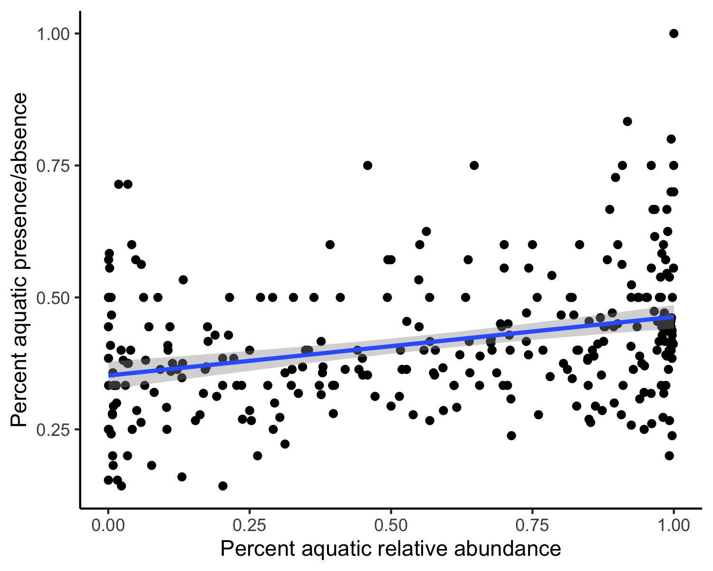

```{r setup, include=FALSE}
knitr::opts_chunk$set(echo = TRUE)
library(knitr)
library(dplyr)
library(ggplot2)
library(here)
library(sjPlot)
library(car)
```

# Overview

This R Markdown document describes the data processing and analyses for Paige Becker's honors thesis. Specifically, it describes processing and working with COI data from tree swallow nestlings and adults using fecal samples collected in the field. The wet lab procedures are not described here. The data processing steps and code to produce initial exploratory figures are located in the script entitled "1_main_script.R," which is found in this same repository. The code for all figures and analyses for Paige's thesis questions (i.e. Question 1, Question 2, and Question 3) are located directly in this script.

# AMPtk Pipeline

All of the raw sequences for these samples were processed using the `AMPtk` pipeline in the command line [@amptk]. We followed very closely the workflow described on the project website `amptk.readthedocs.io/en/latest`. Before running `AMPtk` you need to install the software in a conda environment, install `USEARCH` and download the COI database. Those steps are described in detail on the website and not repeated here.

A few notes:
 
- It seems that currently there is no way to run AMPtk on Mac with OS Catalina because it can't execute the 32bit `USEARCH` program. Use an older computer, virtual machine, or cloud computing.
- The pipeline expects your sequences to be named: `sampleID_whatever_filler_R1/F1.fastq.gz`. The BRC sequences come back with the sample name in the middle. We haven't yet figured out how to make `AMPtk` recognize that, so we've just been batch-renaming the files to get the sample name first.

Once `AMPtk` is installed. The entire pipeline that we've run to this point involves just three commands (will take several hours on a home laptop to run with samples in hundreds). Output files will be saved in the folder where you have set up your conda environment.
 
1. Pre-processing sequence data. Takes a set prefix to add to all files and the forward and reverse primer sequences. Specify input folder where sequences are stored.

> `amptk illumina -i /directory/with/sequences -o trescoi` 
> `-f GCHCCHGAYATRGCHTTYCC -r TCDGGRTGNCCRAARAAYCA`

2. Denoising with `DADA2` [@dada2]. This takes in the processed sequences from step one and applies the denoising algorithm that identifies ASVs and models sequencing error to arrive at a final list of ASVs for F/R reads. Forward and reverse reads are then merged together.

> `amptk dada2 -i tres.coi.demux.fg.gz --platform illumina -o trescoi`

3. Assigning taxonomy. This uses the default suggestions from `AMPtk` documentation, but there are many other options. It applies the 'hybrid taxonomy algorithm', which looks at matches to i) Global Alignment to the downloaded COI arthropod database, ii) UTAX classification, and iii) SINTAX classification. More info is on the website, but basically it retains the best hit that also has the most levels of taxonomic ranks. The arthropod COI database needs to be downloaded and set up for this to run.

> `amptk taxonomy -i trescoi.cluster.otu_table.txt -f trescoi.cluster.otus.fa -d COI`

Those three commands produce a bunch of output files, but only three are needed to pull into `R` for subsequent analyses.

- **trescoi.cluster.otu_table.txt** has samples in columns and OTUs in rows with reads in each cell
- **trescoi.cluster.taxonomy.txt** has full taxonomic information for each OTU
- **trescoi.mapping_file.txt** has one row for each sample to add metadata

(As of March 2021, we were still waiting for the sequences from the BRC from one final sequencing run. In the meantime, due to the large amount of time it takes to run the amptk pipeline, Conor ran two sets of sequencing run results separately through the pipeline. This resulted in two separate sets of files: one from sequencing run results received primarily in November 2020, and one from results received in December 2020. For now, there are two sets of the aforementioned files; they are delineated with "2020_11" or "2020_12." For example, the first file from the November run is named "trescoi_2020_11.cluster.otu_table.txt," and the first file from the December run is named "trescoi_2020_12.cluster.otu_table.txt.")

Those three files are read into the `R` script in this repository as the basis of everything here with the addition of sample metadata. The additional `AMPtk` files are saved in a folder with the repository but are not used further.

**NOTE:** There are many other optional steps in `AMPtk`. For example, one set of commands works to try to remove barcode bleed over where sequences from one barcode/sample are accidentally attributed to other samples. There are different types of classifiers and options, etc. What we've done here is (we think) the basic or bare-bones pipeline.

# Moving to R

The first part of the main script deals with importing those three `AMPtk` files and merging them into a single `phyloseq` object [@phyloseq]. There is a fair amount of wrangling that happens in the script, but it's really all just reformatting and merging things together into the format that `phyloseq` expects. It isn't necessary to use `phyloseq` for a lot of these things, but once the data is merged into that object it is very easy to work with all of their functions for subsetting, filtering, merging, plotting etc. The one thing that is not in here at the moment is a phylogenetic tree for the relationships between the food items. `phyloseq` will accept a tree also and that would allow for things like calculating unifrac & Faith's phylogenetic diversity or plotting diets on trees etc. We could add that later if desired, but it doesn't seem important right now for Paige's honors thesis.
  
Before going any further, we pulled out only the samples relevant for Paige's thesis, and we performed all subsequent filtering and analyses only on those samples. Those samples include:

1) Adult female first capture (incubation) samples from Turkey Hill and Unit 4: 2019 and 2020. This dataset is incomplete; some of these samples for 2020 are on the sequencing run we're still waiting for.

2) Adult female second capture (provisioning) samples from Turkey Hill and Unit 4: 2019 and 2020. This dataset is complete.

3) Nestling fecal samples from day 6 of provisioning from Turkey Hill and Unit 4: 2019 and 2020. This dataset is incomplete; we're missing all of the Turkey Hill day 6 nestling samples from 2020.

4) Gut passage time samples: 2019. These are 25 samples total, taken from day 7 through 12 for five nestlings. These fecal samples were taken during Jenn Houtz's experiment bringing nestlings into captivity.
  
# Sequencing Depth

The first thing we will check is how many sequences we have per sample. This is showing the number of sequences retained for each sample *after* merging, denoising, whatever other filtering dada2 did, and removing everything except for Arthropods. So many of these samples did have quite a few more reads in the initial return. There are two reasons to look at the read counts. First, to see if samples 'worked' for getting data. Most of what we've heard from other people using these techniques is that they expect 5-15% of their samples to just fail to return reads for some reason (no dna, bad extraction, bad amplification, not enough sample added to sequencer, etc). We have been really loading our MiSeq runs with the max samples and they are trying to pool all 384 at even DNA concentrations, so we think it's not surprising that a fair number would fall out. The second reason to look at this is to decide if we might want to rarefy samples to an even depth of reads for some analyses. This could be especially important for comparing alpha diversity metrics. For the purpose of Paige's thesis, we have not rarefied any samples, but it is certainly something we could consider doing.

Here is the log total number of reads per sample for all samples combine (log scale makes it easier to see the variation on the low end, which is what we care about). This plot includes wild adults, wild nestlings, and negative controls.
  
\  
  
There is a reference line showing where 150 reads falls. That is a pretty low number to rarefy to, but even there we lose a bunch of samples that are very low. It might be that in many of those samples all 150 reads are from the same single food item and in some of the higher read samples you still recover the full (or mostly full) community even with only 150 samples.

Here is the same plot with samples broken out by wild adults, wild nestlings, and negative controls.

\

It looks like all but one negative control has very low reads. One thing that we may need to think about is that even though these negative controls have low reads overall, they *do* have some reads that hit on arthropod and other sequences. It's unclear if that means that there was some cross contamination in the lab procedure, or if this is a result of the index-bleed that was mentioned above. We could try to get the `AMPtk` function running for index bleed or alternatively, we could try doing something like only counting a prey item as encountered if there are more than 50 (?) reads for that taxa within a sample. Eliot & Dave are currently using 50 reads as a cuttoff for their warbler diet data. Just as a quick check Conor looked at pruning to a certain number of reads for the negative control samples. If you only include taxa with >25 reads there are only 3 genera retained across all the negative controls, that might be a reasonable criteria.

For now, we're not doing any rarefying for Paige's honors thesis. We might consider doing some rarefying if we end up deciding that presence/absence is and important metric to use.

# Sequencing Depth for Captive Nestlings

Here, we examine the captive nestling samples to see their distribution of total reads, and then their distribution of reads split across days.

This figure shows the distribution of reads with all captive samples considered together.

\

It looks like the total number of reads is definitely frequently above our 150 line.


This figure shows the distribution of reads split out by day.

\

We see that, except for day 6 when there is one sample that had a really high number of reads, there doesn't seem to be any pattern of decreasing reads across days. This is interesting because, once the birds were brought into captivity, they were fed sterile food that shouldn't have had any insects in it. It seems like the insect DNA may be lingering in the tree swallow's gut longer than we think! We can explore what is actually in these samples later, but for the sake of Paige's thesis perhaps this is not something that we should focus on or include?

# Filtering in Phyloseq 

The next steps in the R script are doing filtering steps using `phyloseq`.

- **Agglomerate Taxa**: Many ASVs don't have full species level identification. We can group together at the genus/family/order level to include those samples, or just to make it easier to interpret differences with fewer taxa. For Paige's thesis, we are agglomerating to family because that is most relevant for identifying whether insects have aquatic or terrestrial larval stages.
- **Remove x-tons**: Removing singletons is very common. Some kind of sensitivity analysis removing 1-tons, 5-tons, 25-tons, etc. might be good. See issue described above for negative controls. For Paige's thesis, we have removed 5-tons.
- **Transform to Relative Abundance**: For some analyses we'll want relative abundance rather than raw reads. The function is in the script. This should be done after rarefaction if using even depths (we have not done rarefaction for Paige's thesis).
- **Filter out rare taxa**: It's easy to do things like remove taxa <x% of all reads or <x% of reads within each sample or that appear in <x% of all samples. There are a few reasons to do this. First, it might be helpful for issues discussed above relating to clean up that could be sequencing mistakes, etc. Second, for looking at differential allocation of diet (e.g., to adults vs. nestlings) there is no power to detect differences for diet items that are very rare, so it may be better use of statistical power to focus just on common diet items for those analyses (e.g., genera that are found in >10 or >20% of all fecal samples, etc). For Paige's thesis, we have filtered out taxa that < 1e-5 mean values for relative abundance.
- **Transform to Presence Absence**: Change relative abundance to 1/0 for each taxa.

# Identifying Aquatic and Terrestrial Families

Before working with figures and statistical analyses, we researched what we are referring to as the "life history" classifications of each family; that is, whether their larval stage is aquatic or terrestrial. Once we had all the arthropod families, we exported that list as a .csv file and did research on each individual family to determine whether its larval stage is aquatic or terrestrial. We then imported that file back in with those classifications and joined it with the rest of the dataset.

**Note:** For now, we are using aquatic/terrestrial classifications that were performed by Paige and Jenny. We are currently having Danielle look over these classifications and confirm that they are indeed accurate. There are some classifications that are currently listed as "both" or "unknown," and for now we do not consider those families "aquatic" in our analyses; when calculating "percent aquatic," we only use those families that are definitively aquatic. Notably, Tipulidae and Empididae are very common families that are currently classified as "both" and therefore not counted as "aquatic" in percentage calculations. We may want to rethink this later.

Here, for general exploration of the data, we plot families that occur in over 20% of all samples, and whether they are aquatic or terrestrial.

\

# Calculating "Percent Aquatic" in Each Fecal Sample

This is the point in this R Markdown document where we are making figures and performing analyses directly in this file.

First, we used the aquatic/terrestrial classifications to calculate the percentage of each sample composed of aquatic insects. This is vital for the analyses for Paige's thesis.

To start this process, we imported the two relevant files created by our filtering script: the phyloseq object turned data frame for relative abundance, and the phyloseq object turned data frame for presence/absence. We also imported the sample information file. 

```{r}

plot_ra <- read.csv("plot_ra.csv")

plot_pa <- read.csv("plot_pa.csv")

s_info <- read.delim(here("1_raw_data", "tres_sample_info.txt"))

```
We then went about calculating the "percent aquatic" in each fecal sample. We did this in two ways:

1) We used the relative abundance of aquatic insect families in each sample. To do so, we summed up the percent of reads in each sample that were of an aquatic insect).
2) We used the presence/absence of aquatic insect families in each sample. To do so, we counted up the number of families found in each fecal samples (total), summed up the number of those families that were aquatic (num_aq), and then divided num_aq / total.

```{r, echo = FALSE}

######## Percent aquatic using relative abundance

# Identify the unique samples
sample <- unique(plot_ra$sampleID)

# Create an empty data frame to store relative abundance information
aquatic <- data.frame(matrix(NA, ncol = 2, nrow = length(sample)))
aquatic <- data.frame()
  
for (i in 1:length(sample)){
  sam <- sample[i] # identify sample
  list <- plot_ra[plot_ra$sampleID == sam ,] # pull out all records from plot_ra that have that sample ID
  list_aq <- list[list$life_history == "aquatic" ,] # of those records, pull out only those that have aquatic life histories
  rel_ab <- sum(list_aq$Abundance) # sum up all of the percentages of aquatic insects for that sample
  aquatic[i,1] <- sam # save the sample name
  aquatic[i,2] <- rel_ab # save the total aquatic relative abundance
}

# Name columns
names(aquatic)[names(aquatic) == "V1"] <- "sampleID"
names(aquatic)[names(aquatic) == "V2"] <- "percent_aquatic_ra"

# Add in sample information
aquatic <- merge(aquatic, s_info, by = "sampleID", all.x = TRUE, all.y = FALSE)

######## Percent aquatic using presence/absence

# Identify the unique samples
sample <- unique(plot_pa$sampleID)

# Create an empty data frame to store presence/absence information
pa_aq <- data.frame(matrix(NA, ncol = 2, nrow = length(sample)))
pa_aq <- data.frame()

for (i in 1:length(sample)){
  sam <- sample[i] # identify sample
  list <- plot_pa[plot_pa$sampleID == sam ,] # pull out all records from plot_ra that have that sample ID
  list <- list[list$Abundance != 0 ,] # Only include OTUs in this calculation if they're actually present in the sample
  list_aq <- list[list$life_history == "aquatic" ,] # of those records, pull out only those that have aquatic life histories
  aq_count <- sum(list_aq$Abundance) # sum up all of the percentages of aquatic insects for that sample
  all_count <- (sum(list$Abundance))
  per_aq <- (aq_count / all_count)
  pa_aq[i,1] <- sam # save the sample name
  pa_aq[i,2] <- per_aq # save the total aquatic relative abundance
}

# Name columns
names(pa_aq)[names(pa_aq) == "V1"] <- "sampleID"
names(pa_aq)[names(pa_aq) == "V2"] <- "percent_aquatic_pa"

# Add in sample information
aquatic <- merge(pa_aq, aquatic, by = "sampleID")

# Check to make sure that the data are classified correctly
# str(aquatic) # This is important to check for modeling purposes, but I'm going to comment it out here so it doesn't spit out a long output in the Markdown document.

```

After calculating these metrics for each sample, we examined how they were related just to see what we were working with. Below, we first calculated the correlation between these metrics. We then plotted the relationship between the two metrics. In the figure shown, each point represents a single sample, the x axis shows percent aquatic calculated with the relative abundance, and the y axis shows percent aquatic calculated with presence/absence.

```{r, echo = FALSE}

######## What is the relationship between percent aquatic when it is calculated 
# with relative abundance vs. presence/absence?

p <- ggplot(aquatic, aes(x=percent_aquatic_ra, y = percent_aquatic_pa)) + geom_point() +
  geom_smooth(method=lm) + theme_classic() + xlab("Percent aquatic relative abundance") +
  ylab("Percent aquatic presence/absence")
ggsave(here("3_r_scripts/percent_aquatic_compare.png"), width = 5, height = 4, device = "png")

cor.test(aquatic$percent_aquatic_ra, aquatic$percent_aquatic_pa)
# There is a low correlation between percent aquatic when calculated with relative
# abundance vs. presence/absence.

```

\

We see that there is a relationship between the two metrics, but there is a lot of scatter. Additionally, the relative abundance metric is consistently higher than the corresponding presence/absence metric. This suggests that, if samples have both terrestrial and aquatic insects, there are perhaps fewer numbers of reads of insects in terrestrial families than reads of insects in aquatic families.

# Figures and Analyses for Paige's Thesis

Here, we move in to the questions for Paige's thesis.

### Question 1: What is the relationship between a female’s body condition, as measured by mass, and the aquatic insect content in her diet?

We explored this in two separate subsets of the data: adult female captures from incubation and adult female captures from provisioning.

#### Female incubation body condition vs. aquatic insect diet

```{r, echo = FALSE}
# Filter out just the adults
aquatic_ad <- aquatic[aquatic$age == "Adult" ,]

# Filter out just adults from the first capture
aquatic_ad_cap1 <- aquatic_ad[aquatic_ad$cap_num == "1" ,]
```

##### Aquatic insect content via relative abundance:

To assess this relationship, we used a linear model with percent aquatic as a predictor and mass as the response. In addition to percent aquatic, we also included site and treatment as predictors.

```{r, echo = FALSE}
# Relative abundance
q1_cap1_ra <- plot(aquatic_ad_cap1$percent_aquatic_ra, aquatic_ad_cap1$mass)
mod_q1_cap1_ra <- lm(mass ~ percent_aquatic_ra + site + treatment, data = aquatic_ad_cap1)
#qqPlot(residuals(mod_q1_cap1_ra)) # Assumptions met
#plot(mod_q1_cap1_ra) # Assumptions met
summary(mod_q1_cap1_ra)
```
There does not seem to be a strong relationship between percent aquatic (measured via relative abundance) and mass, although site is an important predictor of mass. Note that there are only 2019 birds in this model because the 2020 birds are on the upcoming sequencing run.

##### Aquatic insect content via presence/absence:

To assess this relationship, we used a linear model with percent aquatic as a predictor and mass as the response. In addition to percent aquatic, we also included site and treatment as predictors.

```{r, echo = FALSE}
# Presence/absence
q1_cap1_pa <- plot(aquatic_ad_cap1$percent_aquatic_pa, aquatic_ad_cap1$mass)
mod_q1_cap1_pa <- lm(mass ~ percent_aquatic_pa + site + treatment, data = aquatic_ad_cap1)
#qqPlot(residuals(mod_q1_cap1_pa)) # Assumptions met
#plot(mod_q1_cap1_pa) # Assumptions met
summary(mod_q1_cap1_pa)
```
There does not seem to be a strong relationship between percent aquatic (measured via presence/absence) and mass, although again, site is an important predictor of mass. Note that there are only 2019 birds in this model because the 2020 birds are on the upcoming sequencing run.

#### Female provisioning body condition

```{r, echo = FALSE}
# Examine second adult capture
aquatic_ad_cap2 <- aquatic_ad[aquatic_ad$cap_num != "1" ,]
```

##### Aquatic insect content via relative abundance:

To assess this relationship, we used a linear model with percent aquatic as a predictor and mass as the response. In addition to percent aquatic, we also included site and treatment as predictors.

```{r, echo = FALSE}
# Relative abundance
q1_cap2_ra <- plot(aquatic_ad_cap2$mass~aquatic_ad_cap2$percent_aquatic_ra)
mod_q1_cap2_ra <- lm(mass ~ percent_aquatic_ra + site + treatment, data = aquatic_ad_cap2)
#qqPlot(residuals(mod_q1_cap2_ra)) # Assumptions met
#plot(mod_q1_cap2_ra) # Assumptions met
summary(mod_q1_cap2_ra)
```
There does not seem to be a strong relationship between percent aquatic (measured via relative abundance) and mass. Note that this model includes both 2019 and 2020 birds.

##### Aquatic insect content via presence/absence:

To assess this relationship, we used a linear model with percent aquatic as a predictor and mass as the response. In addition to percent aquatic, we also included site and treatment as predictors.

```{r, echo = FALSE}
# Presence/absence
plot(aquatic_ad_cap2$mass~aquatic_ad_cap2$percent_aquatic_pa)
mod_q1_cap2_pa <- lm(mass ~ percent_aquatic_pa + site + treatment, data = aquatic_ad_cap2)
#qqPlot(residuals(mod_q1_cap2_pa)) # The residuals are not distributed normally; this may be an issue.
#plot(mod_q1_cap2_pa)
summary(mod_q1_cap2_pa)
```
There does not seem to be a strong relationship between percent aquatic (measured via presence/absence) and mass...though percent aquatic is getting a little closer to a p-value of less than 0.05. Note that this model includes both 2019 and 2020 birds.

Additionally, this model may not be appropriate, as the residuals are not distributed normally.

### Question 2: How do the proportions of aquatic insects in the adult diets compare to the proportions of aquatic insects in the diets of their nestlings?

We first need to subset the data to make sure we're only working with wild birds, and only birds from the provisioning captures. We're only going to compare the proportions of aquatic insects in the diets of adults vs. nestlings during their provisioning period, because obviously we do not have nestling samples from the incubation period.

```{r, echo = FALSE}

# Subset data to exclude captive nestling samples
aquatic_wild <- aquatic[aquatic$site == "Unit_4" | aquatic$site == "Turkey_Hill" ,]

# Filter data just to adult and nestling captures during provisioning
# (i.e. take out first adult captures during provisioning)
aquatic_wild_ad <- aquatic_wild[aquatic_wild$cap_num != "1" & aquatic_wild$age == "Adult" ,]
aquatic_wild_nest <- aquatic_wild[aquatic_wild$age == "Nestling" ,]
aquatic_wild_prov <- rbind(aquatic_wild_ad, aquatic_wild_nest)

```

##### Aquatic insect content via relative abundance:

To assess how nestling diet (via relative abundance) compares to adult diet, we started off by using an ANOVA, with predictors age, site, age*site, and treatment, and response variable percent aquatic. However, after checking model assumptions, it is clear that the residuals are not distributed normally. It's unclear which non-parametric equivalent is most appropriate in this context.

```{r, echo = FALSE}
# Relative abundance
boxplot(percent_aquatic_ra~age*site, data = aquatic_wild_prov)
mod_q2_ra <- aov(percent_aquatic_ra ~ age*site + treatment, data = aquatic_wild_prov)
#qqPlot(residuals(mod_q2_ra)) # The residuals are not distributed normally! Does not fit the assumption of homoscedasticity.
# Log transforming the "percent_aquatic_ra" does not help.
#plot(mod_q2_ra) # Another visualization that shows that the model does not fit assumptions.
```

There does, however, seem to be an interesting pattern here that is worth further exploring.

##### Aquatic insect content via presence/absence:

To assess how nestling diet (via presence/absence) compares to adult diet, we started off by using an ANOVA, with predictors age, site, age*site, and treatment, and response variable percent aquatic. However, after checking model assumptions, it is clear that the residuals are not distributed normally. It's unclear which non-parametric equivalent is most appropriate in this context.

```{r, echo = FALSE}
# Presence/absence
boxplot(percent_aquatic_pa~age*site, data = aquatic_wild_prov)
mod_q2_pa <- aov(percent_aquatic_pa ~ age*site + treatment, data = aquatic_wild_prov)
#qqPlot(residuals(mod_q2_pa)) # The residuals are not distributed normally! Does not fit the assumption of homoscedasticity.
# Log transforming the "percent_aquatic_ra" does not help.
#plot(mod_q2_pa) # Another visualization that shows that the model does not fit assumptions.
```

Again, there do seem like some interesting patterns here that are worthy of further exploration.

### Question 3: What is the relationship between adult and nestling diet content?

To answer this question, we took the nestlings in each nest and calculated the average percent aquatic insects in their diet. This gave us an average nestling value to match with each adult. We did this for both percent aquatic calculated with relative abundance and percent aquatic calculated with presence/absence.

During this process, we realized that we have pretty low coverage for Turkey Hill birds. For example, there were only two nests from Turkey Hill in 2019 that had both adult and nestling samples from provisioning, and we are still waiting on the sequencing run results from Turkey Hill nestlings from 2020. On the bright side, Unit 4 adult/nestling matching samples were plentiful from both 2019 and 2020.

```{r, echo = FALSE}
# Create column for unit_box
aquatic_wild_prov$site_box <- paste(aquatic_wild_prov$site, aquatic_wild_prov$nest, aquatic_wild_prov$year, sep="_")

# Pull out nestlings to average across nest
aquatic_wild_prov_n <- aquatic_wild_prov[aquatic_wild_prov$age == "Nestling" ,]

# Pull out adults
aquatic_wild_prov_a <- aquatic_wild_prov[aquatic_wild_prov$age == "Adult" ,]

######## Relative abundance calculations

# Create an empty dataframe to store relative abundance information for each nest
nests <- unique(aquatic_wild_prov_n$site_box)
aquatic_wild_prov_npooled <- data.frame(matrix(NA, ncol = 2, nrow = length(nests)))
aquatic_wild_prov_npooled <- data.frame()

# Calculate average aquatic percentage with relative abundance for the nestlings in each nest
for (i in 1:length(nests)){
  nest <- nests[i] # identify nest
  list <- aquatic_wild_prov_n[aquatic_wild_prov_n$site_box == nest ,] # pull out all nestlings from that nest
  mean_aq <- mean(list$percent_aquatic_ra) # average % aquatic insects
  aquatic_wild_prov_npooled[i,1] <- nest # save the nest name
  aquatic_wild_prov_npooled[i,2] <- mean_aq # save the total aquatic relative abundance
}

# Name columns
names(aquatic_wild_prov_npooled)[names(aquatic_wild_prov_npooled) == "V1"] <- "site_box"
names(aquatic_wild_prov_npooled)[names(aquatic_wild_prov_npooled) == "V2"] <- "percent_aquatic_ra_nestlings_mean"

# Combine adults with pooled nestling percentages
aquatic_wild_prov_a <- merge(aquatic_wild_prov_a, aquatic_wild_prov_npooled, by = "site_box")

######## Presence/absence calculations

# Create an empty dataframe to store presence/absence information for each nest
nests <- unique(aquatic_wild_prov_n$site_box)
aquatic_wild_prov_npooled <- data.frame(matrix(NA, ncol = 2, nrow = length(nests)))
aquatic_wild_prov_npooled <- data.frame()

# Calculate average aquatic percentage with presence/absence for the nestlings in each nest
for (i in 1:length(nests)){
  nest <- nests[i] # identify nest
  list <- aquatic_wild_prov_n[aquatic_wild_prov_n$site_box == nest ,] # pull out all nestlings from that nest
  mean_aq <- mean(list$percent_aquatic_pa) # average % aquatic insects using presence/absence
  aquatic_wild_prov_npooled[i,1] <- nest # save the nest name
  aquatic_wild_prov_npooled[i,2] <- mean_aq # save the total aquatic percent
}

# Name columns
names(aquatic_wild_prov_npooled)[names(aquatic_wild_prov_npooled) == "V1"] <- "site_box"
names(aquatic_wild_prov_npooled)[names(aquatic_wild_prov_npooled) == "V2"] <- "percent_aquatic_pa_nestlings_mean"

# Combine adults with pooled nestling percentages
aquatic_wild_prov_a <- merge(aquatic_wild_prov_a, aquatic_wild_prov_npooled, by = "site_box")
```

##### Aquatic insect content via relative abundance:

To assess this relationship, we used a linear model with percent aquatic of adults as a predictor and percent aquatic of nest as the response. In addition, we also included site and treatment as predictors.

```{r, echo = FALSE}
# Relative abundance
q3_ra <- plot(percent_aquatic_ra_nestlings_mean~percent_aquatic_ra, data = aquatic_wild_prov_a, 
              xlab = "Percent Aquatic Adult (relative abundance)", ylab = "Percent Aquatic Nest (relative abundance)")
mod_q3_ra <- lm(percent_aquatic_ra_nestlings_mean ~ percent_aquatic_ra + site + treatment, data = aquatic_wild_prov_a)
#qqPlot(residuals(mod_q3_ra)) # Assumptions met
#plot(mod_q3_ra) # Assumptions met
summary(mod_q3_ra)
```
None of these predictors do a good job of explaining each nest-level percent aquatic.

##### Aquatic insect content via presence/absence:

To assess this relationship, we used a linear model with percent aquatic of adults as a predictor and percent aquatic of nest as the response. In addition, we also included site and treatment as predictors.

```{r, echo = FALSE}
# Presence/absence
q3_pa <- plot(percent_aquatic_pa_nestlings_mean~percent_aquatic_pa, data = aquatic_wild_prov_a, 
              xlab = "Percent Aquatic Adult (presence/absence)", ylab = "Percent Aquatic Nest (presence/absence)")
mod_q3_pa <- lm(percent_aquatic_pa_nestlings_mean ~ percent_aquatic_pa + site + treatment, data = aquatic_wild_prov_a)
# qqPlot(residuals(mod_q3_pa)) # The residuals are not distributed normally; this may be an issue.
# plot(mod_q3_pa)
summary(mod_q3_pa)
```

None of these predictors do a good job of explaining each nest-level percent aquatic. Additionally, this model may not be appropriate, as the residuals are not distributed normally.

### Literature Cited
